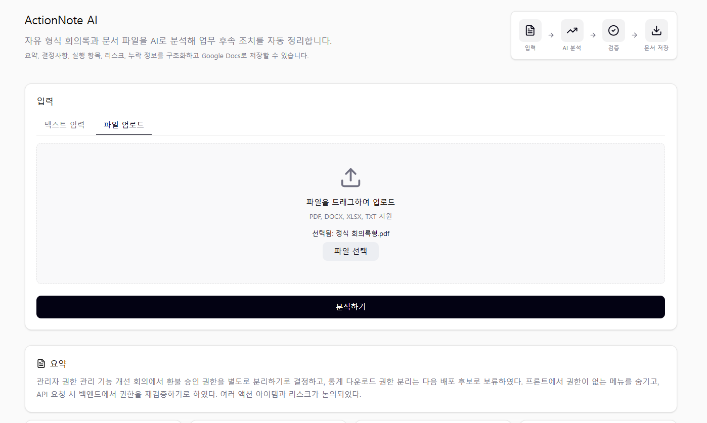
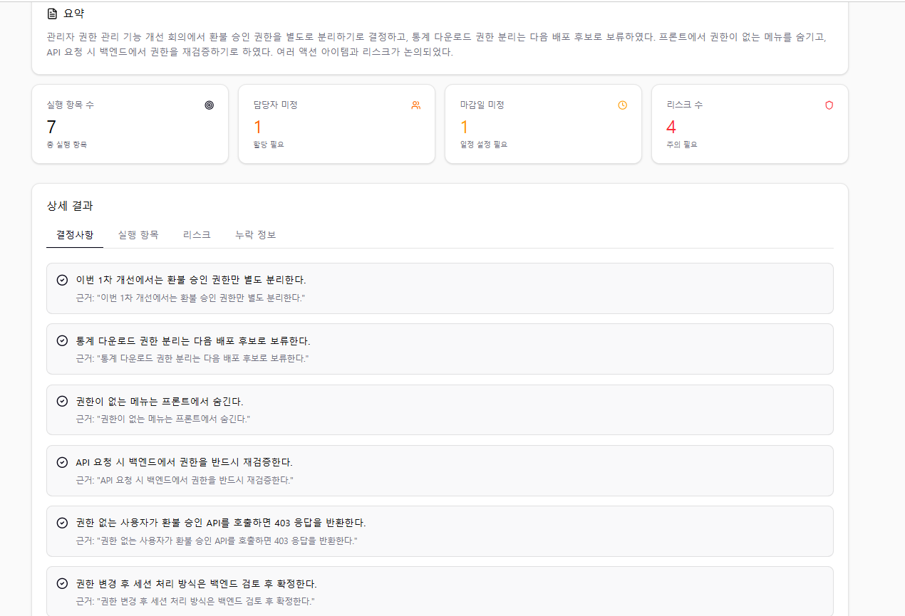
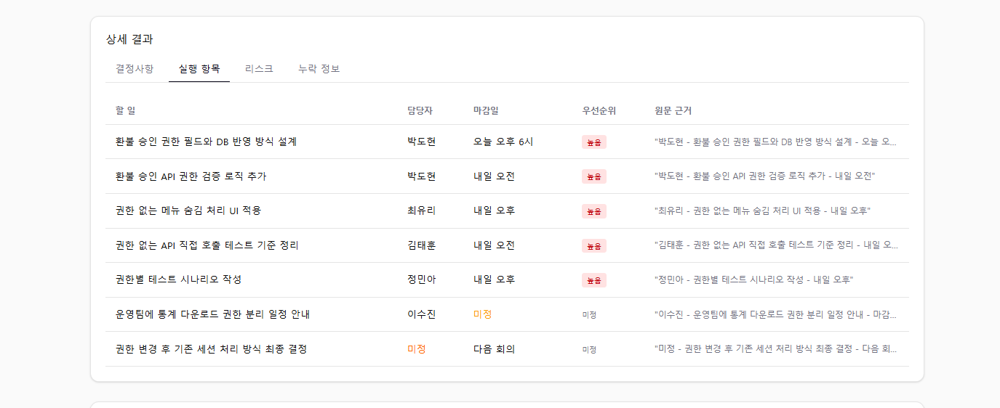
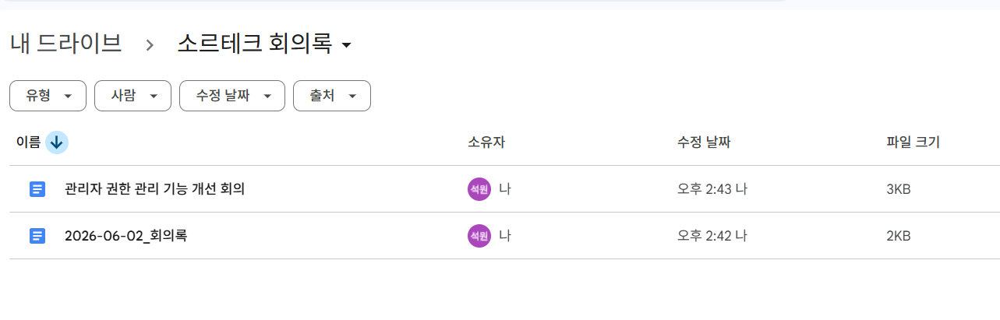

# ActionNote AI

<div align="center">
  <h3>자유 형식 회의록·업무 메모·문서 파일을 업무 후속 조치 중심으로 구조화하는 AI 자동화 도구</h3>
  <p><b>React 기반 한 페이지 UI · FastAPI 백엔드 · OpenAI 분석 · Google Docs 저장 · 원문 근거 기반 검증</b></p>
</div>

---

## 목차

* [1. 프로젝트 개요](#1-프로젝트-개요)
* [2. 개발 배경과 문제 정의](#2-개발-배경과-문제-정의)
* [3. 핵심 기능](#3-핵심-기능)
* [4. 기술 스택](#4-기술-스택)
* [5. 시스템 구조](#5-시스템-구조)
* [6. 전체 동작 흐름](#6-전체-동작-흐름)
* [7. AI 분석 구조](#7-ai-분석-구조)
* [8. Google Docs 저장 흐름](#8-google-docs-저장-흐름)
* [9. 주요 화면](#9-주요-화면)
* [10. 트러블슈팅](#10-트러블슈팅)
* [11. 현재 구현 범위와 제한사항](#11-현재-구현-범위와-제한사항)
* [12. 실행 방법](#12-실행-방법)
* [13. AI 활용 기록과 회고](#13-ai-활용-기록과-회고)

---

## 1. 프로젝트 개요

**ActionNote AI**는 자유 형식 회의록, 업무 메모, 문서 파일을 입력하면 AI가 내용을 분석해 업무 후속 조치에 필요한 정보를 구조화해주는 작은 자동화 도구입니다.

단순히 회의록을 요약하는 데 그치지 않고, 회의 이후 실제로 필요한 정보를 다음과 같이 분리합니다.

* 요약
* 결정사항
* 실행 항목
* 담당자
* 마감일
* 우선순위
* 리스크
* 누락 정보
* 원문 근거

또한 분석 결과를 화면에서 확인하는 것에 그치지 않고, Google Docs 문서로 저장해 팀원과 공유할 수 있도록 구성했습니다.

---

## 2. 개발 배경과 문제 정의

회의나 업무 논의가 끝난 뒤에는 보통 다음과 같은 반복 작업이 발생합니다.

* 회의 내용을 다시 읽고 핵심 요약 작성
* 결정된 사항 정리
* 누가 어떤 일을 해야 하는지 정리
* 담당자와 마감일 확인
* 아직 정해지지 않은 정보 파악
* 리스크나 주의사항 따로 정리
* 공유용 문서로 저장

문제는 회의록이나 업무 메모가 항상 정해진 양식으로 작성되지 않는다는 점입니다.
실제 업무에서는 메신저 대화, 자유 형식 메모, PDF 문서, 엑셀 표처럼 다양한 형태로 정보가 남습니다.

그래서 이 프로젝트에서는 특정 회의록 양식을 강제하지 않고, 다양한 입력을 먼저 텍스트로 정규화한 뒤 동일한 AI 분석 흐름으로 처리하도록 설계했습니다.

---

## 3. 핵심 기능

### 3.1 자유 형식 텍스트 분석

사용자가 직접 입력한 회의록, 업무 메모, 메신저 대화 등을 분석합니다.

분석 결과는 다음 구조로 반환됩니다.

```json
{
  "summary": "전체 요약",
  "decisions": [],
  "action_items": [],
  "risks": [],
  "missing_info": []
}
```

---

### 3.2 문서 파일 업로드 분석

다음 파일 형식을 지원합니다.

* TXT
* DOCX
* PDF
* XLSX

각 파일은 먼저 텍스트로 추출된 뒤, 텍스트 입력과 동일한 AI 분석 함수로 전달됩니다.
이를 통해 입력 방식이 달라도 분석 흐름을 하나로 유지했습니다.

---

### 3.3 업무 후속 조치 중심 구조화

AI는 단순 요약이 아니라 다음 항목을 분리합니다.

#### 결정사항

회의에서 확정된 내용입니다.

```json
{
  "content": "Google Docs 저장 기능은 유지한다.",
  "evidence_text": "Google Docs 저장 기능은 제출용 차별화 요소로 유지한다."
}
```

#### 실행 항목

실제로 해야 할 작업입니다.

```json
{
  "task": "README 제한사항 작성",
  "owner": "정석원",
  "due_date": "내일 오전",
  "priority": "미정",
  "evidence_text": "README에 PDF 제한사항을 작성한다."
}
```

#### 리스크

업무 진행 중 문제가 될 수 있는 요소입니다.

```json
{
  "risk": "PDF 표 추출 시 텍스트 순서가 일부 섞일 수 있다.",
  "response": "README에 제한사항으로 명시한다.",
  "evidence_text": "PDF 표 추출은 일부 순서가 섞일 수 있다."
}
```

---

### 3.4 담당자·마감일 미정 처리

AI가 원문에 없는 담당자나 마감일을 임의로 추측하지 않도록 했습니다.

담당자, 마감일, 우선순위가 명확하지 않은 경우 다음과 같이 처리합니다.

```text
미정
```

이를 통해 AI가 그럴듯한 값을 만들어내는 문제를 줄이고, 사용자가 누락된 정보를 확인할 수 있게 했습니다.

---

### 3.5 원문 근거 표시

각 결정사항, 실행 항목, 리스크에는 `evidence_text`를 포함합니다.

이 값은 AI가 어떤 원문을 근거로 결과를 만들었는지 확인하기 위한 필드입니다.
사용자는 분석 결과를 원문과 비교하며 검증할 수 있습니다.

---

### 3.6 Google Docs 저장

분석 결과를 Google Docs 문서로 저장할 수 있습니다.

실제 회사에서는 회의록을 별도 폴더에 보관하고 팀원과 공유하는 경우가 많다고 판단했습니다.
그래서 Google Drive에 회의록 폴더를 지정하고, 분석 결과를 Google Docs 형태로 저장하는 흐름을 추가했습니다.

지원 기능:

* 사용자가 문서 이름 직접 입력
* 이름을 비워두면 날짜 기반 자동 이름 생성
* 같은 이름이 이미 있으면 `_1`, `_2` 형식으로 자동 번호 부여
* 지정한 Google Drive 폴더에 저장
* 생성된 Google Docs 링크 반환

자동 이름 예시:

```text
2026-06-04_회의록
2026-06-04_회의록_1
2026-06-04_회의록_2
```

---

## 4. 기술 스택

### Frontend

* React
* TypeScript
* Vite
* Tailwind CSS
* Figma AI 기반 UI 초안

### Backend

* FastAPI
* Python
* Pydantic
* Uvicorn

### AI

* OpenAI API
* GPT-4o-mini

### File Parsing

* TXT: 기본 텍스트 디코딩
* DOCX: python-docx
* PDF: PyMuPDF
* XLSX: openpyxl

### External API

* Google Docs API
* Google Drive API
* Google OAuth

---

## 5. 시스템 구조

```text
[React Frontend]
  ├─ 텍스트 입력
  ├─ 파일 업로드
  ├─ 분석 결과 대시보드
  ├─ 결정사항 / 실행 항목 / 리스크 / 누락 정보 탭
  └─ Google Docs 저장 요청
          │
          ▼
[FastAPI Backend]
  ├─ /api/analyze-text
  ├─ /api/analyze-file
  └─ /api/save-google-doc
          │
          ▼
[Services]
  ├─ ai_service.py
  │   └─ OpenAI API 호출 및 JSON 구조화
  ├─ file_parser.py
  │   └─ TXT / DOCX / PDF / XLSX 텍스트 추출
  └─ google_docs_service.py
      └─ Google Docs 생성 및 Drive 폴더 이동
```

---

## 6. 전체 동작 흐름

### 6.1 텍스트 입력 분석

```text
사용자 텍스트 입력
→ React에서 /api/analyze-text 호출
→ FastAPI가 OpenAI API 호출
→ JSON 분석 결과 반환
→ 프론트에서 요약, 대시보드, 상세 결과 표시
```

---

### 6.2 파일 업로드 분석

```text
사용자 파일 업로드
→ React에서 /api/analyze-file 호출
→ FastAPI에서 파일 확장자 확인
→ 파일 내용을 텍스트로 추출
→ analyze_text() 함수 재사용
→ 분석 결과 반환
```

---

### 6.3 Google Docs 저장

```text
분석 결과 생성
→ 사용자가 문서 이름 입력
→ /api/save-google-doc 호출
→ Google Docs 문서 생성
→ 지정한 Google Drive 폴더로 이동
→ 생성된 문서 링크 반환
```

---

## 7. AI 분석 구조

### 7.1 출력 JSON 구조

AI 응답은 다음 구조를 기준으로 처리됩니다.

```json
{
  "summary": "전체 요약",
  "decisions": [
    {
      "content": "결정사항",
      "evidence_text": "원문 근거"
    }
  ],
  "action_items": [
    {
      "task": "해야 할 일",
      "owner": "담당자 또는 미정",
      "due_date": "마감일 또는 미정",
      "priority": "높음/보통/낮음/미정",
      "evidence_text": "원문 근거"
    }
  ],
  "risks": [
    {
      "risk": "리스크",
      "response": "대응 방향 또는 미정",
      "evidence_text": "원문 근거"
    }
  ],
  "missing_info": [
    "누락되거나 불명확한 정보"
  ]
}
```

---

### 7.2 분석 규칙

AI 분석 프롬프트에는 다음 기준을 포함했습니다.

* 원문에 있는 정보만 사용
* 담당자, 마감일, 우선순위가 명확하지 않으면 “미정” 처리
* JSON 형식으로만 응답
* 각 항목에 원문 근거인 `evidence_text` 포함
* 결정사항, 실행 항목, 리스크, 누락 정보를 분리
* 파일 입력도 텍스트 입력과 동일한 분석 흐름으로 처리

---

### 7.3 검증 기준

테스트 시 다음 항목을 확인했습니다.

* 비정형 업무 메모에서도 구조화가 되는지
* 결정사항과 실행 항목이 구분되는지
* 리스크가 별도 분리되는지
* 담당자와 마감일이 불명확할 때 “미정” 처리되는지
* `evidence_text`가 실제 원문과 연결되는지
* 새 분석 시 이전 Google Docs 저장 링크가 초기화되는지

---

## 8. Google Docs 저장 흐름

Google Docs 저장 기능은 단순 다운로드보다 실제 업무 흐름에 가깝게 만들기 위해 추가했습니다.

### 8.1 저장 규칙

* 문서 이름을 입력하면 해당 이름으로 저장
* 이름을 입력하지 않으면 날짜 기반 기본 이름 사용
* 같은 이름이 있으면 `_1`, `_2` 형식으로 중복 방지
* `.env`의 `GOOGLE_DRIVE_FOLDER_ID`에 지정된 폴더로 이동

---

### 8.2 보안 파일

다음 파일은 GitHub에 올리지 않습니다.

```text
backend/.env
backend/credentials.json
backend/token.json
.env
.env.local
credentials.json
token.json
```

---

## 9. 주요 화면

### 9.1 첫 화면

* 서비스 설명
* 텍스트 입력 / 파일 업로드 탭
* 분석 전 안내 카드
* 처리 흐름 설명

### 9.2 분석 결과 화면

* 요약 카드
* 액션 아이템 수
* 담당자 미정 수
* 마감일 미정 수
* 리스크 수


### 9.3 상세 결과 화면

* 결정사항
* 실행 항목
* 리스크
* 누락 정보
* 원문 근거 `evidence_text`


### 9.4 Google Docs 저장 화면

* 문서 이름 입력
* Google Docs 저장 버튼
* 저장 완료 후 문서 링크 표시


---

## 10. 트러블슈팅

### 10.1 파일 업로드 API Not Found

#### 문제 상황

TXT, DOCX 파일 업로드 시 프론트에서 `Not Found`가 발생했습니다.

#### 원인

처음에는 파일 파서 문제라고 생각했지만, Swagger에서 실제 등록 경로를 확인해 보니 API 경로가 다음처럼 등록되어 있었습니다.

```text
/api/api/analyze-file
```

`main.py`와 router 양쪽에서 `/api` prefix가 중복으로 붙은 것이 원인이었습니다.

#### 해결 방법

* 프론트 요청 경로 확인
* FastAPI router prefix 확인
* Vite proxy 확인
* Swagger에서 실제 등록 경로 확인
* router 내부의 중복 prefix 제거

수정 후 정상 경로:

```text
/api/analyze-file
```

---

### 10.2 Google OAuth access_denied

#### 문제 상황

Google Docs 저장 인증 과정에서 `access_denied`가 발생했습니다.

#### 원인

Google Cloud OAuth 동의 화면에서 테스트 사용자에 현재 계정이 등록되어 있지 않았습니다.

#### 해결 방법

* Google Cloud Console 접속
* OAuth consent screen 확인
* Test users에 사용 계정 추가
* `token.json` 삭제 후 재인증

---

### 10.3 새 분석 후 이전 Google Docs 링크가 남는 문제

#### 문제 상황

새로운 텍스트나 파일을 분석했는데 이전 분석 결과의 Google Docs 저장 링크가 화면에 남아 있었습니다.

#### 원인

백엔드 문제가 아니라 React 상태 초기화 문제였습니다.

#### 해결 방법

새 분석 시작 시 다음 상태를 초기화했습니다.

```ts
setSavedDocUrl(null);
setDocTitle("");
```

---

### 10.4 AI가 애매한 마감일을 설명형 문장으로 반환

#### 문제 상황

마감일이 불명확한 경우 `due_date`에 “마감일도 애매함” 같은 설명형 문장이 들어가는 경우가 있었습니다.

#### 해결 방법

* 프롬프트에서 불명확한 값은 반드시 “미정”으로 반환하도록 강화
* 후처리에서 “애매”, “불명확”, “추후” 등의 표현은 “미정”으로 정규화

---

## 11. 현재 구현 범위와 제한사항

### 11.1 구현된 기능

* 자유 형식 텍스트 분석
* TXT 파일 분석
* DOCX 파일 분석
* PDF 파일 분석
* XLSX 파일 분석
* 요약 / 결정사항 / 실행 항목 / 리스크 / 누락 정보 추출
* 담당자·마감일 미정 처리
* 원문 근거 `evidence_text` 표시
* Google Docs 저장
* Google Drive 지정 폴더 저장
* 문서명 자동 생성 및 중복 방지

---

### 11.2 제한사항

* PDF는 텍스트 기반 PDF를 대상으로 합니다.
* 스캔 PDF OCR은 이번 범위에서 제외했습니다.
* PDF 표 구조는 텍스트 추출 과정에서 일부 순서가 섞일 수 있습니다.
* HWP/HWPX는 이번 범위에서 제외했습니다.
* Google Docs 저장 기능은 로컬 실행 시 Google Cloud OAuth 설정이 필요합니다.
* OpenAI API Key와 Google credentials 파일은 별도로 설정해야 합니다.

---

### 11.3 향후 개선 방향

* PDF 표 추출 품질 개선
* Google Docs 문서 내부를 표 형태로 저장
* 분석 전 파일 텍스트 미리보기 기능
* HWP/HWPX 지원 검토
* 스캔 PDF OCR 지원 검토
* 팀 단위 공유 권한 설정 기능

---

## 12. 실행 방법

### 12.1 Backend 설정

```bash
cd backend
python -m venv note_venv
note_venv\Scripts\activate
cd ..
cd ..
pip install -r requirements.txt
```

---

### 12.2 Backend 환경변수 설정

`backend/.env` 파일을 생성합니다.

```env
OPENAI_API_KEY=your-openai-api-key
OPENAI_MODEL=gpt-4o-mini
GOOGLE_DRIVE_FOLDER_ID=your-google-drive-folder-id
```

---

### 12.3 Google 인증 파일 설정

Google Cloud Console에서 OAuth Desktop Client를 생성한 뒤, 다운로드한 파일을 다음 위치에 둡니다.

```text
backend/credentials.json
```

처음 Google Docs 저장을 실행하면 브라우저 인증이 진행되고, 인증 후 다음 파일이 생성됩니다.

```text
backend/token.json
```

이 파일들은 GitHub에 올리지 않습니다.

---

### 12.4 Backend 실행

```bash
uvicorn main:app --reload --port 8000
```

Swagger 확인:

```text
http://localhost:8000/docs
```

---

### 12.5 Frontend 실행

프로젝트 루트에서 실행합니다.

```bash
npm install
npm run dev
```

Frontend 접속:

```text
http://localhost:5173
```

---

## 13. 테스트 방법

### 13.1 텍스트 분석 테스트

```text
1. 텍스트 입력 탭 선택
2. 자유 형식 회의록 또는 업무 메모 입력
3. 분석하기 클릭
4. 요약, 대시보드, 상세 결과 확인
```

---

### 13.2 파일 업로드 테스트

```text
1. 파일 업로드 탭 선택
2. TXT, DOCX, PDF, XLSX, MD 파일 업로드
3. 분석하기 클릭
4. 결과 확인
```

---

### 13.3 Google Docs 저장 테스트

```text
1. 분석 결과 생성
2. Google Docs 문서 이름 입력
3. 저장 버튼 클릭
4. 생성된 문서 링크 확인
5. Google Drive 지정 폴더에 저장되었는지 확인
```

---

## 14. AI 활용 기록과 회고

본 과제는 결과물뿐 아니라 AI를 어떻게 활용했는지가 중요하다고 판단하여, 별도 문서로 정리했습니다.

* `docs/ai_prompts.md`: 사용한 AI 도구와 핵심 프롬프트
* `docs/retrospective.md`: 과제 진행 회고

AI 도구는 다음과 같이 역할을 나누어 활용했습니다.

* Figma AI: React 한 페이지 UI 초안 설계
* Gemini CLI: 프론트·백엔드 연결을 위한 구조 분석과 기본 틀 생성
* ChatGPT: 구현 순서 정리, 오류 원인 분석, 테스트 케이스 작성 및 검증
